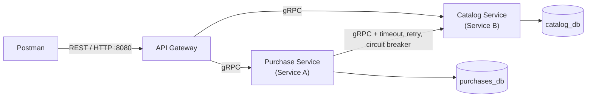
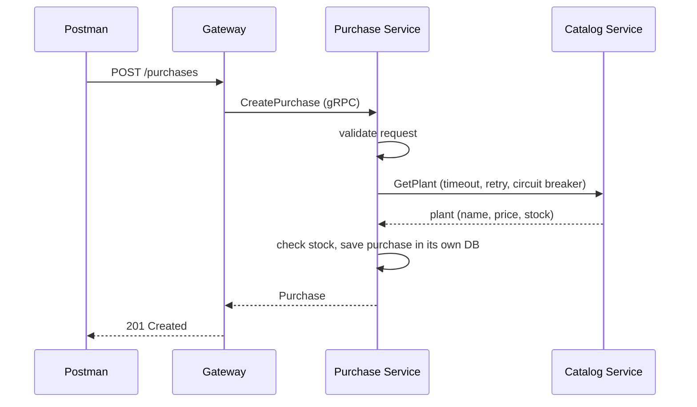

# Plant Nursery: Two Collaborating Microservices

A small but complete distributed application written in **Go**. A **Catalog service** owns plants, a
**Purchase service** owns purchases of those plants, and a REST **API Gateway** is the single entry point.
The services communicate over **gRPC** (Protocol Buffers), each has **its own PostgreSQL database**, and the
call from Purchase to Catalog is protected by a **timeout, retries with backoff and a circuit breaker**.
The whole system starts with one command: `docker compose up --build`.

## Contents

- [Architecture](#architecture)
- [Quick start](#quick-start)
- [API reference](#api-reference)
- [Validation](#validation)
- [Resilience](#resilience-purchase--catalog)
- [Configuration](#configuration)
- [Project layout](#project-layout)
- [Postman collection](#postman-collection)
- [Local development without Docker](#local-development-without-docker)
- [Design decisions](#design-decisions)

## Architecture



How a purchase is created:



| Component | Role | Owns | Port |
|---|---|---|---|
| `gateway` | REST to gRPC entry point | nothing | 8080 (published to the host) |
| `catalog-service` | **Service B**: plants (the independent resource) | `catalog_db` | 50051 (internal) |
| `purchase-service` | **Service A**: purchases (depends on plants) | `purchases_db` | 50052 (internal) |
| `catalog-db`, `purchases-db` | PostgreSQL 17, one per service | n/a | internal only |

**Database per Service.** Each service has its own Postgres container, and each database sits on its own
Docker network, reachable only from its owning service. Purchase stores just a `plant_id` (no foreign key)
plus a snapshot of the plant's name and price, and reaches plant data only through Catalog's gRPC API.

## Quick start

**Requirements:** Docker with Compose. Nothing else needs to be installed.

```bash
git clone <your-repo-url>
cd plant-nursery
docker compose up --build      # builds all images and starts all 5 containers
```

The API is now available at `http://localhost:8080` (health check: `GET /healthz`).

```bash
# create a plant
curl -s -X POST localhost:8080/plants -H 'Content-Type: application/json' \
  -d '{"name":"Monstera deliciosa","species":"Araceae","price_cents":1299,"stock":10}'

# buy two of them (use the id returned above)
curl -s -X POST localhost:8080/purchases -H 'Content-Type: application/json' \
  -d '{"plant_id":"<PLANT_ID>","quantity":2,"customer_name":"Alice"}'
```

Stop with `Ctrl+C`. Remove containers **and** data with `docker compose down -v`.

## API reference

| Method and path | Description | Success |
|---|---|---|
| `POST /plants` | Create a plant | 201 |
| `GET /plants` | List plants | 200 |
| `GET /plants/{id}` | Retrieve a plant | 200 |
| `PUT /plants/{id}` | Replace a plant | 200 |
| `DELETE /plants/{id}` | Delete a plant | 204 |
| `POST /purchases` | Create a purchase (confirms the plant and stock with Catalog) | 201 |
| `GET /purchases` | List purchases (enriched with live plant data) | 200 |
| `GET /purchases/{id}` | Retrieve a purchase (enriched with live plant data) | 200 |
| `PUT /purchases/{id}` | Update quantity, customer name and status | 200 |
| `DELETE /purchases/{id}` | Delete a purchase | 204 |
| `GET /healthz` | Gateway health check | 200 |

Prices are integers in **cents** (`price_cents`). A purchase looks like this:

```json
{
  "id": "0b8f6c1e-5d0a-4c55-9a52-2f4f3b6a8c10",
  "plant_id": "7c9e6679-7425-40de-944b-e07fc1f90ae7",
  "plant_name": "Monstera deliciosa",
  "unit_price_cents": 1299,
  "quantity": 2,
  "total_cents": 2598,
  "customer_name": "Alice",
  "status": "PENDING",
  "created_at": "2026-10-08T10:15:00Z",
  "current_price_cents": 1299,
  "current_stock": 10,
  "plant_details_stale": false
}
```

`plant_name` and `unit_price_cents` are a snapshot taken at purchase time. `current_price_cents` and
`current_stock` are fetched live from Catalog; if Catalog cannot be reached they are 0 and
`plant_details_stale` is `true`.

### Error responses

Errors always have the same shape: `{"error": {"code": "NotFound", "message": "plant not found"}}`.
The gateway maps gRPC status codes to HTTP status codes:

| gRPC status | HTTP status | Typical cause |
|---|---|---|
| `InvalidArgument` | 400 | Failed validation, malformed JSON, malformed ID |
| `NotFound` | 404 | Plant or purchase does not exist |
| `AlreadyExists`, `FailedPrecondition` | 409 | Insufficient stock |
| `Unavailable` | 503 | Catalog is down or the circuit breaker is open |
| `DeadlineExceeded` | 504 | A downstream call timed out |
| anything else | 500 | Unexpected error (logged server-side, details never returned) |

## Validation

Validation lives inside the services, so invalid data is rejected no matter who calls them and is never
stored. The database also has `CHECK` constraints as a second line of defence.

| Resource | Rules |
|---|---|
| Plant | `name` and `species` required (max 100 chars, whitespace trimmed); `price_cents` > 0; `stock` >= 0 |
| Purchase | `plant_id` a valid UUID; `quantity` between 1 and 100; `customer_name` required (max 100 chars); `status` one of `PENDING`, `COMPLETED`, `CANCELLED` |
| IDs in URLs | Must be valid UUIDs |

The gateway additionally rejects malformed JSON, wrong field types and unknown fields with a 400.
Quantities above the available stock are rejected with a 409.

## Resilience (Purchase → Catalog)

Every Catalog lookup made by the Purchase service passes through, in order:
**retry → circuit breaker → per-attempt timeout → gRPC call.**

| Setting (env var) | Default | Meaning |
|---|---|---|
| `CATALOG_TIMEOUT` | `1s` | Deadline for each attempt |
| `CATALOG_MAX_ATTEMPTS` | `3` | Total attempts per lookup |
| `CATALOG_RETRY_BASE` | `100ms` | First backoff delay; doubles on each retry, with jitter |
| `CATALOG_BREAKER_THRESHOLD` | `3` | Consecutive failures that open the circuit |
| `CATALOG_BREAKER_OPEN_TIMEOUT` | `10s` | How long the circuit stays open before one probe request |

- Only `Unavailable` and `DeadlineExceeded` are retried and counted by the breaker. Answers such as
  `NotFound` mean Catalog is healthy and are returned as they are.
- While the circuit is **open**, calls fail immediately without retries. After the open timeout it goes
  **half-open** and lets one probe through; success closes it again.
- **When Catalog is down:** creating a purchase returns a clean **503** (never a hang or crash), and
  retrieving a purchase still returns **200** with the stored data and `"plant_details_stale": true`.
- The worst-case time for one lookup (about 3.3 s) is deliberately below the gateway's `UPSTREAM_TIMEOUT`.

Try it while watching the Purchase service logs:

```bash
docker compose logs -f purchase-service   # in one terminal

docker compose stop catalog-service       # service DOWN: retries, breaker opens, instant 503s
docker compose start catalog-service      # recovery: half-open, then closed

docker compose pause catalog-service      # service HANGING: shows the timeout (~3 s before the 503)
docker compose unpause catalog-service
```

## Configuration

All configuration comes from environment variables; nothing is hard-coded. Docker Compose reads the root
`.env` file, which contains **demo-only development values** (do not reuse these credentials anywhere real).

| Variable | Used by | Purpose |
|---|---|---|
| `GATEWAY_PORT` | gateway | Published HTTP port |
| `UPSTREAM_TIMEOUT` | gateway | Max time for one downstream gRPC call |
| `DB_PORT` | both services | Postgres port inside the Docker network |
| `CATALOG_GRPC_PORT` | catalog, purchase, gateway | Catalog's gRPC port |
| `CATALOG_DB_USER`, `CATALOG_DB_PASSWORD`, `CATALOG_DB_NAME` | catalog and its DB | Catalog database credentials |
| `PURCHASE_GRPC_PORT` | purchase, gateway | Purchase's gRPC port |
| `PURCHASE_DB_USER`, `PURCHASE_DB_PASSWORD`, `PURCHASE_DB_NAME` | purchase and its DB | Purchase database credentials |
| `CATALOG_TIMEOUT`, `CATALOG_MAX_ATTEMPTS`, `CATALOG_RETRY_BASE`, `CATALOG_BREAKER_THRESHOLD`, `CATALOG_BREAKER_OPEN_TIMEOUT` | purchase | Resilience settings (see above) |

Each service fails fast at startup with a clear message if a required variable is missing.

## Project layout

```
proto/                 .proto definitions and generated Go code (regenerate with: make proto)
catalog-service/       Service B: main, config, gRPC handlers, validation, repository, Dockerfile
purchase-service/      Service A: handlers, validation, repository, Catalog client + resilience, Dockerfile
gateway/               REST handlers, JSON helpers, gRPC-to-HTTP error mapping, middleware, Dockerfile
postman/               Exported Postman collection
docker-compose.yml     The whole system (5 containers, 3 networks, 2 volumes)
.env                   Configuration for Docker Compose (demo values)
Makefile               `make proto` regenerates the gRPC code
```

Each service follows the same layering: `main.go` wires things together, `config.go` reads the environment,
`server.go` holds the gRPC handlers, `validation.go` holds the input rules, and `repository.go` is the only
file that contains SQL. The three Dockerfiles are multi-stage: a Go build stage produces a static binary,
and the final image is a minimal non-root distroless image containing only that binary.

## Postman collection

Import `postman/plant-nursery.postman_collection.json`, keep the collection variable
`baseUrl = http://localhost:8080`, and run the folders in order: **Plants**, **Purchases**, **Error cases**.
The create requests save the new IDs into collection variables (`plantId`, `tempPlantId`, `purchaseId`),
and every request has a test asserting its expected status code, so the Collection Runner shows a full
pass/fail result. Postman only ever talks to the API Gateway.

## Local development without Docker

Requires Go 1.26.5, `protoc` with `protoc-gen-go` and `protoc-gen-go-grpc`, and two Postgres instances.

```bash
make proto                                        # regenerate gRPC code after editing a .proto file
cp catalog-service/.env.example  catalog-service/.env
cp purchase-service/.env.example purchase-service/.env
cp gateway/.env.example          gateway/.env
# in three terminals, loading each service's environment first:
set -a; source catalog-service/.env; set +a;  go run ./catalog-service
set -a; source purchase-service/.env; set +a; go run ./purchase-service
set -a; source gateway/.env; set +a;          go run ./gateway
```

## Design decisions

- **Snapshot in purchases.** `plant_name` and `unit_price_cents` are copied at purchase time, so purchase
  history stays correct if a plant is later repriced or deleted, and no cross-database join is needed.
- **No foreign key across services.** The services must not share a database, so `plant_id` is just a value
  that Purchase verifies by calling Catalog.
- **Money as integer cents** to avoid floating-point rounding errors.
- **Catalog client behind an interface.** Resilience is a decorator around the plain gRPC client, so the
  handlers did not change and the client can be faked in tests.
- **Read-side fallback.** Retrieving purchases degrades gracefully (stored data plus a stale flag) instead
  of failing when Catalog is down; creating purchases fails with 503 because it cannot be done safely.
- **Stock is checked but not decremented.** Decrementing would require a distributed transaction or saga
  across two databases, which is outside this assignment's scope.
- **Internal errors are never leaked.** Unexpected errors are logged in full but only a generic message is
  returned to the caller.
